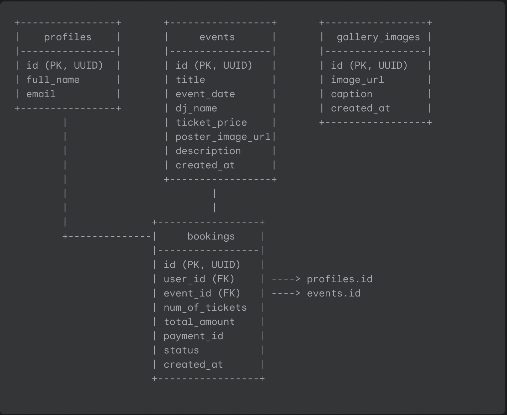

# **Nightclub Website: Database Schema (PostgreSQL)**

## **Guiding Philosophy**

This schema is designed for a PostgreSQL database, as used by Supabase. It is structured to be relational, ensuring data integrity and efficiency for the features outlined in the core-features.md document. The tables are normalized to reduce data redundancy and provide a solid foundation for the application.

## **Schema Diagram**

This diagram illustrates the relationships between the core tables in our database.

\+----------------+       \+-----------------+       \+-----------------+  
|    profiles    |       |     events      |       |  gallery\_images |  
|----------------|       |-----------------|       |-----------------|  
| id (PK, UUID)  |       | id (PK, UUID)   |       | id (PK, UUID)   |  
| full\_name      |       | title           |       | image\_url       |  
| email          |       | event\_date      |       | caption         |  
\+----------------+       | dj\_name         |       | created\_at      |  
        |                | ticket\_price    |       \+-----------------+  
        |                | poster\_image\_url|  
        |                | description     |  
        |                | created\_at      |  
        |                \+-----------------+  
        |                        |  
        |                        |  
        |              \+-----------------+  
        \+--------------|     bookings    |  
                       |-----------------|  
                       | id (PK, UUID)   |  
                       | user\_id (FK)    | \----\> profiles.id  
                       | event\_id (FK)   | \----\> events.id  
                       | num\_of\_tickets  |  
                       | total\_amount    |  
                       | payment\_id      |  
                       | status          |  
                       | created\_at      |  
                       \+-----------------+

## **Table Definitions**

### **1\. Table: profiles**

* **Purpose:** Stores public user profile information. This table is designed to work with Supabase's built-in auth.users table. You will create a trigger so that when a new user signs up via Supabase Auth, a corresponding row is automatically created here.  
* **Supabase Note:** The id of this table will be a foreign key that references the id in the private auth.users table.

| Column Name | Data Type | Constraints & Notes |
| :---- | :---- | :---- |
| id | UUID | **Primary Key**. Foreign Key to auth.users.id. |
| full\_name | VARCHAR(255) | The user's full name (from Google or registration). |
| email | VARCHAR(255) | **UNIQUE**. The user's email. Stored here for easy access. |
| created\_at | TIMESTAMPTZ | Defaults to NOW(). Timestamp of profile creation. |

#### **Indexes:**

* An index will be automatically created on the primary key id.  
* An index will be automatically created on email due to the UNIQUE constraint.

### **2\. Table: events**

* **Purpose:** Stores all information about nightclub events. This table will be managed by the club staff directly via the Supabase dashboard.

| Column Name | Data Type | Constraints & Notes |
| :---- | :---- | :---- |
| id | UUID | **Primary Key**. Defaults to gen\_random\_uuid(). |
| title | VARCHAR(255) | **NOT NULL**. The title of the event (e.g., "Bollywood Night"). |
| event\_date | TIMESTAMPTZ | **NOT NULL**. The date and start time of the event. |
| dj\_name | VARCHAR(255) | The name of the featured DJ or artist. |
| ticket\_price | INT | **NOT NULL**, CHECK (ticket\_price \>= 0). Price per ticket in the smallest currency unit (e.g., paise). |
| poster\_image\_url | TEXT | The public URL of the event poster (from Supabase Storage). |
| description | TEXT | A detailed description of the event. |
| created\_at | TIMESTAMPTZ | Defaults to NOW(). Timestamp of event creation. |

#### **Indexes:**

* An index will be automatically created on the primary key id.  
* Create an index on event\_date to speed up queries for upcoming or past events: CREATE INDEX idx\_events\_event\_date ON events(event\_date);

### **3\. Table: bookings**

* **Purpose:** This is the "join table" that connects users and events. A new row is created here every time a user successfully purchases a ticket.

| Column Name | Data Type | Constraints & Notes |
| :---- | :---- | :---- |
| id | UUID | **Primary Key**. Defaults to gen\_random\_uuid(). |
| user\_id | UUID | **Foreign Key** to profiles.id on delete CASCADE. **NOT NULL**. |
| event\_id | UUID | **Foreign Key** to events.id on delete CASCADE. **NOT NULL**. |
| num\_of\_tickets | INT | **NOT NULL**, CHECK (num\_of\_tickets \> 0). The number of tickets purchased. |
| total\_amount | INT | **NOT NULL**, CHECK (total\_amount \> 0). The total amount paid (in paise). |
| payment\_id | VARCHAR(255) | **UNIQUE, NOT NULL**. The transaction ID from the payment gateway. |
| status | VARCHAR(50) | Defaults to 'confirmed'. The status of the booking (e.g., "confirmed", "cancelled"). |
| created\_at | TIMESTAMPTZ | Defaults to NOW(). Timestamp of the booking. |

#### **Indexes:**

* An index will be automatically created on the primary key id and payment\_id.  
* Create indexes on the foreign keys user\_id and event\_id to speed up lookups for guest lists and user booking history:  
  * CREATE INDEX idx\_bookings\_user\_id ON bookings(user\_id);  
  * CREATE INDEX idx\_bookings\_event\_id ON bookings(event\_id);

### **4\. Table: gallery\_images**

* **Purpose:** Stores the URLs for all photos that will be displayed on the public gallery page.

| Column Name | Data Type | Constraints & Notes |
| :---- | :---- | :---- |
| id | UUID | **Primary Key**. Defaults to gen\_random\_uuid(). |
| image\_url | TEXT | **NOT NULL**. The public URL of the image (from Supabase Storage). |
| caption | VARCHAR(255) | An optional caption for the photo. |
| created\_at | TIMESTAMPTZ | Defaults to NOW(). Order by this DESC to show newest photos first. |

## **Sample SQL Queries**

Here are some example queries that the backend API would execute to power the website's features.

#### **1\. Fetch all upcoming events for the Events Calendar page.**

SELECT id, title, event\_date, dj\_name, poster\_image\_url  
FROM events  
WHERE event\_date \>= NOW()  
ORDER BY event\_date ASC;

#### **2\. Fetch the guest list for a specific event (for the Admin Panel).**

This query joins bookings with profiles to get the names of the attendees.

SELECT  
    b.id as booking\_id,  
    p.full\_name,  
    p.email,  
    b.num\_of\_tickets,  
    b.created\_at  
FROM  
    bookings b  
JOIN  
    profiles p ON b.user\_id \= p.id  
WHERE  
    b.event\_id \= 'a1b2c3d4-e5f6-7890-1234-567890abcdef' \-- Replace with the actual event\_id  
ORDER BY  
    p.full\_name;

#### **3\. Fetch a specific user's booking history for their profile page.**

This query joins bookings with events to show details of the events a user has booked.

SELECT  
    b.id as booking\_id,  
    e.title as event\_title,  
    e.event\_date,  
    b.num\_of\_tickets,  
    b.total\_amount,  
    b.status  
FROM  
    bookings b  
JOIN  
    events e ON b.event\_id \= e.id  
WHERE  
    b.user\_id \= 'f1e2d3c4-b5a6-7890-1234-567890abcdef' \-- Replace with the actual user\_id  
ORDER BY  
    e.event\_date DESC;  

